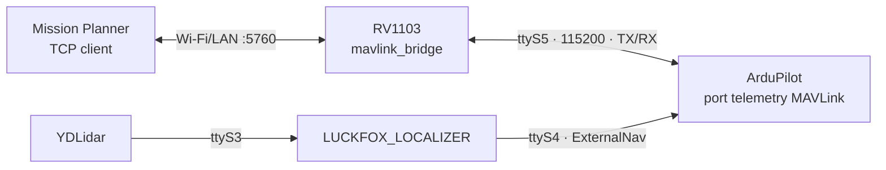

# Luckfox MAVLink UART ↔ TCP bridge

Aplikasi C++ terpisah yang berjalan di RV1103 sebagai TCP server untuk Mission
Planner. Meneruskan byte serial dua arah, tanpa dependensi ROS, Python, SDK
MAVLink, atau localizer pada board. MAVLink 1, MAVLink 2, CRC, sequence number,
system/component ID, dan signature diteruskan apa adanya.



Default:

| Pengaturan | Nilai |
|---|---|
| UART ke ArduPilot | `/dev/ttyS5` |
| Baud UART | `115200`, 8N1, tanpa RTS/CTS |
| Bind TCP | `0.0.0.0` (semua interface IPv4) |
| Port TCP | `5760` |
| Klien aktif | Satu Mission Planner |
| Autostart | `/etc/init.d/S98mavlink_bridge` |
| Konfigurasi | `/etc/default/mavlink_bridge` |
| Log | `/tmp/mavlink_bridge.log` |

## Wiring Pico Mini

UART5_M1 harus aktif pada firmware (I2C3 pada pin tersebut dinonaktifkan).

| Pico Mini | Sambungkan ke ArduPilot |
|---|---|
| Pin 15 / GPIO1_D3 / UART5 TX | RX port TELEM yang dipilih |
| Pin 14 / GPIO1_D2 / UART5 RX | TX port TELEM yang dipilih |
| GND | GND |

Gunakan UART TTL 3.3 V. Ini bukan koneksi RS-232 atau kabel USB langsung.
Label COM di Windows biasanya berasal dari USB–serial; bridge ini memakai
UART TTL pada port telemetry ArduPilot.

UART4 tetap menjadi jalur ExternalNav dari localizer. Jika kedua aplikasi
berjalan bersamaan, gunakan **dua port MAVLink ArduPilot yang berbeda** untuk
UART4 dan UART5. Jangan menggabungkan dua TX ke satu RX atau membuka UART
Luckfox yang sama dengan dua aplikasi. Bila FC hanya menyediakan satu port,
arsitektur perlu diganti menjadi satu router yang memiliki UART tersebut.

## Pengaturan ArduPilot

Pada port FC yang tersambung ke UART5, misalnya TELEM1 yang dipetakan ke SERIAL1:

```text
SERIAL1_PROTOCOL = 2
SERIAL1_BAUD     = 115
```

`115` adalah pengaturan 115200 baud. Nomor `SERIAL1` adalah pemetaan di FC,
bukan nomor UART Luckfox; sesuaikan dengan board ArduPilot. Untuk kabel hanya
TX/RX/GND, nonaktifkan flow control port FC bila tersedia (misalnya
`BRD_SER1_RTSCTS=0`). Reboot FC setelah mengubah parameter yang memerlukannya.
Lihat [pengaturan serial resmi ArduPilot](https://ardupilot.org/copter/docs/common-telemetry-port-setup.html).

Bridge meneruskan heartbeat asli ArduPilot dan request Mission Planner,
termasuk pembacaan parameter, mission upload/download, serta perintah kontrol.
Bridge tidak membuat heartbeat sendiri atau mengubah parameter/stream rate FC.
Signing MAVLink dapat dipakai end-to-end bila FC dan Mission Planner sudah
dikonfigurasi: bridge hanya membawa byte signature, tidak memvalidasinya.

## Koneksi Mission Planner

1. Pastikan PC dan RV1103 terhubung jaringan yang sama.
2. Cari IP RV1103 dengan `ip -4 addr show wlan0` pada board.
3. Di pilihan koneksi Mission Planner, pilih **TCP**, lalu **CONNECT**.
4. Isi alamat IP **RV1103**, misalnya `192.168.1.50`, dan port **5760**.
5. Tunggu heartbeat ArduPilot dan pembacaan parameter.

TCP client Mission Planner terhubung ke server RV1103, bukan sebaliknya.
`0.0.0.0` adalah alamat bind server; jangan memasukkannya sebagai alamat tujuan
Mission Planner. Dukungan koneksi TCP GCS dijelaskan pada
[dokumentasi ArduPilot](https://ardupilot.org/dev/docs/using-sitl-for-ardupilot-testing.html).
Port `5760` ini raw TCP, bukan HTTP/WebSocket.

Baud pada konfigurasi bridge harus cocok dengan UART FC; TCP sendiri tidak
memiliki baud rate. TCP tidak memakai autentikasi/TLS pada aplikasi ini;
gunakan jaringan tepercaya/VPN karena klien terhubung dapat mengirim perintah
ke FC, sesuai otorisasi yang diterapkan MAVLink/ArduPilot.

## Menjalankan dan konfigurasi pada board

Dengan image terbaru dari pipeline Mini, bridge otomatis aktif saat boot,
terpisah dari START/STOP mission localizer. Tidak perlu menunggu dashboard.

```sh
/etc/init.d/S98mavlink_bridge status
cat /etc/default/mavlink_bridge
tail -f /tmp/mavlink_bridge.log
```

Isi konfigurasi:

```sh
ENABLED=1
UART=/dev/ttyS5
BAUD=115200
BIND_ADDRESS=0.0.0.0
TCP_PORT=5760
```

Setelah diedit, jalankan `/etc/init.d/S98mavlink_bridge restart`.
Menjalankan manual untuk diagnosis:

```sh
/etc/init.d/S98mavlink_bridge stop
/usr/bin/mavlink_bridge --serial /dev/ttyS5 --baud 115200 \
  --bind 0.0.0.0 --port 5760
```

Baud yang didukung: 57600, 115200, 230400, 460800, 921600.
`--bind` menerima alamat IPv4 numerik. `--help` menampilkan opsi aplikasi.

## Build terpisah dan pemasangan

Dari root repository, memakai environment SLAM dan toolchain SDK RV1103:

```bash
micromamba run -n SLAM bash LUCKFOX_MAVLINK_BRIDGE/scripts/build_rv1103.sh
```

Binary hasil: `LUCKFOX_MAVLINK_BRIDGE/build/rv1103/mavlink_bridge` (ARM).
Untuk memasang tanpa rebuild image, hentikan service lama pada board dahulu,
lalu salin binary dan file berikut ke board memakai SCP/SFTP:

| File lokal | Tujuan pada board |
|---|---|
| `build/rv1103/mavlink_bridge` | `/usr/bin/mavlink_bridge` |
| `buildroot/S98mavlink_bridge` | `/etc/init.d/S98mavlink_bridge` |
| `buildroot/mavlink_bridge.default` | `/etc/default/mavlink_bridge` |

Path lokal pada tabel relatif terhadap folder aplikasi ini. Pertahankan
konfigurasi board yang sudah disesuaikan ketika memperbarui binary.
Kemudian pada board:

```sh
chmod 755 /usr/bin/mavlink_bridge /etc/init.d/S98mavlink_bridge
/etc/init.d/S98mavlink_bridge start
```

UART5 tetap memerlukan DTB dengan UART5_M1 aktif; memasang binary saja tidak
mengubah pinmux.

## Build firmware Mini

```bash
micromamba run -n SLAM env RV1103_BOARD_MODEL=mini \
  bash RV1103_BUILDROOT/scripts/build_spi_nand.sh
```

Pipeline memasang package Buildroot `luckfox-mavlink-bridge` secara terpisah,
mengaktifkan UART5, dan mengaktifkan service untuk **Pico Mini SPI NAND/Mini B**.
Profil lain memasang aplikasi dengan autostart nonaktif hingga UART dikonfigurasi.
Image hasil: `RV1103_BUILDROOT/luckfox-pico/output/image/update.img`.

## Perilaku koneksi dan batasan

- Satu klien aktif; koneksi kedua ditutup agar tidak mencampur perintah dua GCS.
- UART belum tersedia/terputus: retry setiap 1 detik. Koneksi TCP ditutup saat
  UART putus; sambungkan ulang Mission Planner setelah UART pulih.
- Tidak ada GCS: telemetry tetap dibaca dan dibuang, bukan disimpan untuk sesi
  berikutnya. CMD yang belum diteruskan dibuang ketika sesi berakhir.
- Buffer aplikasi dibatasi 64 KiB tiap arah. Backpressure TCP digunakan untuk
  arah ke serial; klien diputus saat buffer telemetry penuh atau forwarding
  tersendat sekitar 2 detik. Tidak mengulang perintah dari koneksi sebelumnya.
- TCP keepalive mendeteksi koneksi mati yang tidak mengirim FIN. Sesudah kabel
  jaringan/Wi-Fi putus, koneksi lama mungkin perlu timeout sebelum klien baru
  diterima. Request/perintah yang sudah sampai FC tidak bisa ditarik kembali.
- Tidak ada parser, filter, konversi protokol, perekam telemetry, atau multiplexing
  localizer. CRC/frame yang rusak dari UART tetap menjadi tanggung jawab parser
  MAVLink di FC/GCS. Pada reconnect, tunggu frame/heartbeat lengkap berikutnya.

## Pengujian

```bash
micromamba run -n SLAM cmake -S LUCKFOX_MAVLINK_BRIDGE \
  -B LUCKFOX_MAVLINK_BRIDGE/build/host -DCMAKE_BUILD_TYPE=Release
micromamba run -n SLAM cmake --build LUCKFOX_MAVLINK_BRIDGE/build/host -j4
micromamba run -n SLAM ctest --test-dir LUCKFOX_MAVLINK_BRIDGE/build/host \
  --output-on-failure
```

Tes Python standard library memakai pseudo-TTY dan TCP loopback: forwarding
MAVLink 1/2 dan bytes signature, fragmentasi, transfer 256 KiB dua arah,
penolakan klien kedua, reconnect TCP/UART, telemetry sesi lama, slow client,
validasi argumen, dan SIGTERM. Pengujian ini tidak menggantikan pengujian kabel,
UART fisik, baud, dan Mission Planner pada hardware.

Diagnosis log: `serial_connected` memastikan port dibuka; `client_connected`
menandai GCS tersambung; `serial_rx_bytes`/`tcp_rx_bytes` adalah penghitung byte
masuk total sejak proses mulai (termasuk telemetry tanpa klien). Jika TCP
terhubung tetapi Mission Planner tidak mendapat heartbeat, periksa RX UART5,
baud dan `SERIALx_PROTOCOL` FC. Jika telemetry masuk tetapi request parameter
macet, periksa TX UART5 dan RX FC.
